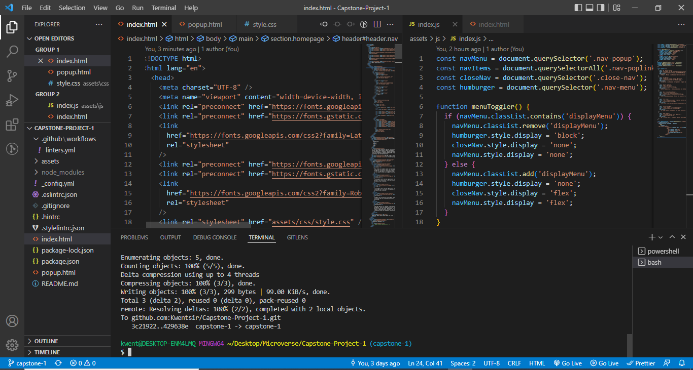

# Ghana Tech Summit 2022

> This website was created in fulfillment of the requirement for HTML/CSS capstone project.

## Built With

- HTML
- CSS
- JavaScript

## Live Demo

[Live Demo Link](https://kwentsir.github.io/Capstone-Project-1/)

### Video Presentation

[Video presentation link](https://www.loom.com/share/4d2a27daabad4ef8ac2181914aea8bb7)

## Snapshots

## Getting Started

To get a local copy up and running follow these simple example steps.

- Copy this link `https://github.com/Kwentsir/Capstone-Project-1`.

## Authors

👤 **Joseph Kwesi Kwentsir**

## 🤝 Contributing

Contributions, issues, and feature requests are welcome!

Feel free to check the [issues page](../../issues/).

## Show your support

Give a ⭐️ if you like this project!

## Attributions

This web design was inspired by [Cindy Shin](https://www.behance.net/adagio07)
on [this idea](https://www.behance.net/gallery/29845175/CC-Global-Summit-2015).

## 📝 License

This project is [MIT](./MIT.md) licensed.
